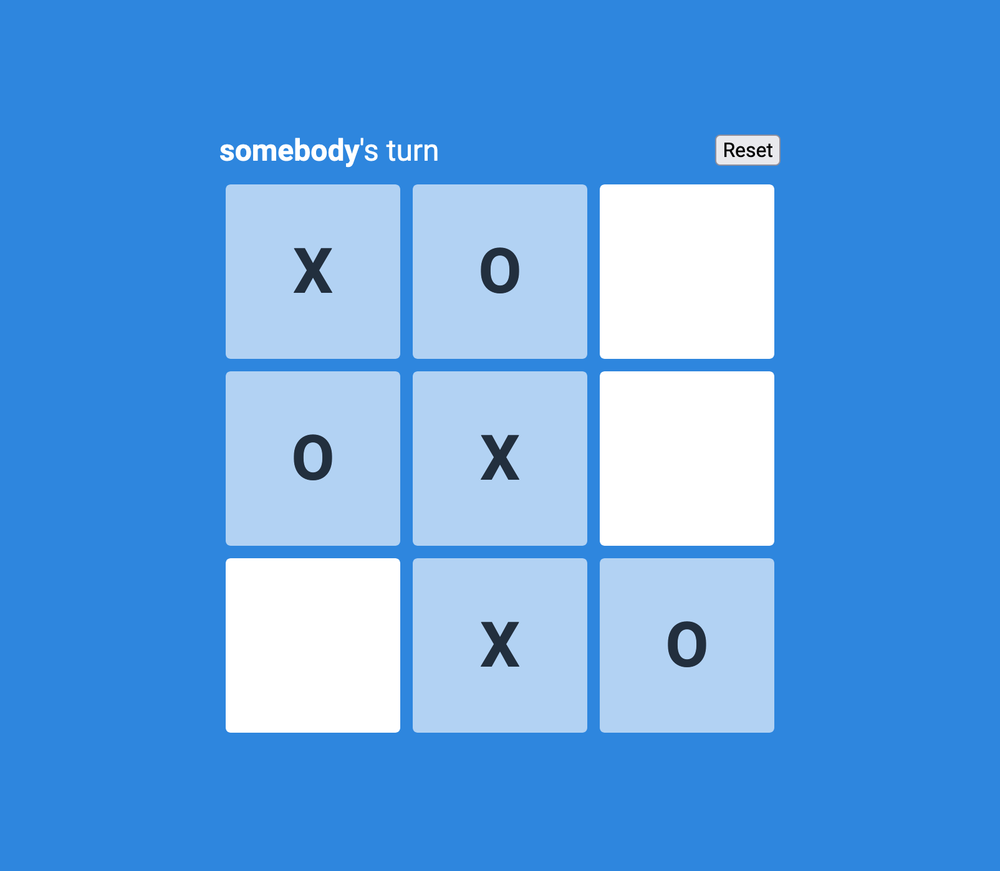

# Toro Front-end Challenge

This repository contains a minimal implementation of the game [Tic-Tac-Toe](https://en.wikipedia.org/wiki/Tic-tac-toe). The project utilizes [TypeScript](https://www.typescriptlang.org/) and [React](https://reactjs.org/) and is built with [Vite](https://vitejs.dev/).

## Prerequisites

- Node.js latest LTS version (v16.13.1)
- npm latest LTS version (v8.1.2)

The [node.js website](https://nodejs.org/en/) provides downloads for a number of systems. The installers bundle npm alongside node.

- An editor. [Visual Studio Code](https://code.visualstudio.com/) was used to create this project and provides excellent TypeScript support out of the box, but any editor will do the trick.

## Setup

1. Clone the repository: `git clone https://github.com/TTCColorado/toro-front-end-challenge.git`
2. Move into the cloned directory: `cd toro-front-end-challenge`
3. Install the dependencies: `npm install`

## Run for development

1. Vite provides a super-fast dev server with HMR. Run it with `npm run dev`
2. Navigate to [http://localhost:3000](http://localhost:3000)

## Build and preview

1. To run a production build: `npm run build`
2. To preview the build output with a local static server: `npm run preview`
3. Navigate to [http://localhost:5000](http://localhost:5000)
